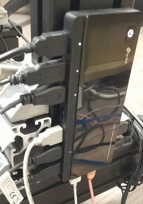
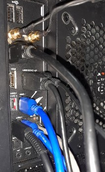
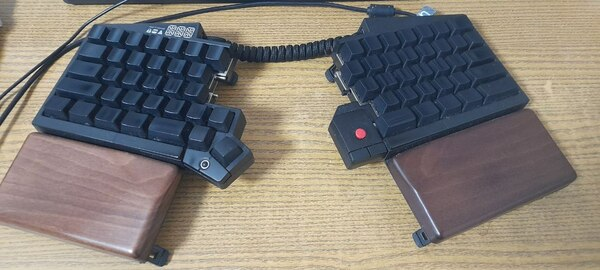
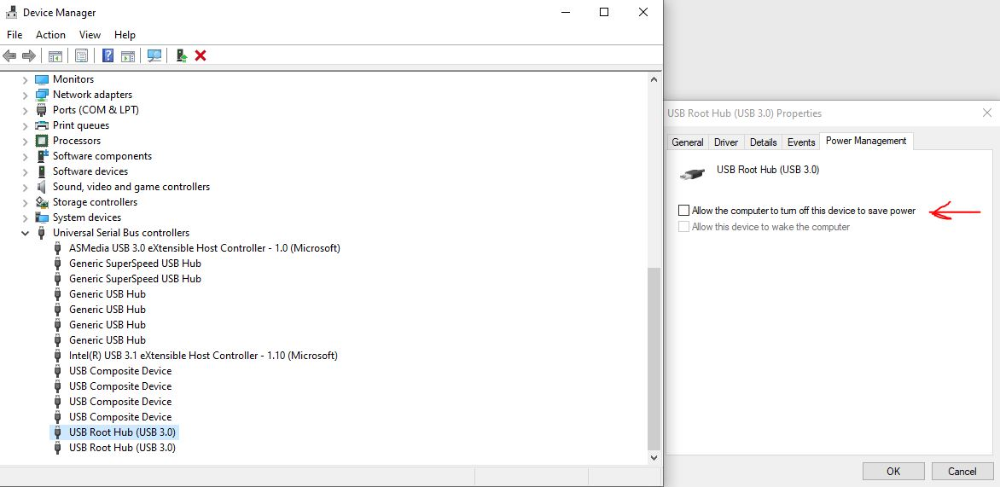
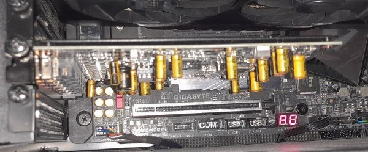
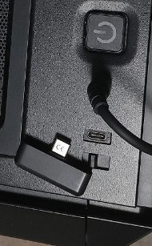

## Freezing USB issues

This is a long and arduous story of trying to find a source of freezing issues on my high-end PC when using many USB devices at once.

Recently I noticed that from time to time my mouse starts to stutter and freeze, and sometimes random keys won't be pressed on the keyboard.

I have a pretty high-end PC, specifically assembled to be as fast and robust as possible. I hated this issue from the start. I just needed to dive into it and find and fix the source of this problem.

### Setting the stage

First of all, let's discuss the hardware. I have:

* Gigabyte Aorus z390 Ultra motherboard
* i9 9900k CPU
* 32 Gb of DDR4 RAM @3200 Hz
* GPU in the first x16 PCIe slot
* 2 NVMe SSDs (inserted into mobo M.2 slots) and 1 SATA SSD
* External Asus sound card inserted into x1 PCIe mobo slot
* A lot of USB devices

By a lot, I mean A LOT.

I am a simracer and I have a lot of equipment running off USB ports at the same time. Most of the time I simrace in VR, which includes VR headset and its sensors which are also inserted into USB ports and use a lot of throughput. Actually I can't insert all my devices directly into the mobo, I need to use some kind of USB hub. Let's list all the USB devices here:

Connected directly into mobo:

* USB Hub #1 (through USB 2.0, since I don't need the speed here)
    * Wireless mouse
    * Keyboard (DAS Keyboard)
    * Keyboard (UHK)
* Oculus Rift Headset (USB 3.0, maximum throughput)
* Oculus Rift CV1 sensor #1 (USB 3.0, maximum throughput)
* Oculus Rift CV1 sensor #2 (USB 3.0, maximum throughput)
* Oculus Rift CV1 sensor #3 (USB 2.0, intentionally limiting throughput)
* USB Hub #2 (the same make and model as USB Hub #1)
    * Simucube wheelbase
    * Fanatec Clubsport H-pattern gearbox
    * Thrustmaster sequential gearbox
    * Heusinkveld Ultimate+ pedals
    * Heusinkveld handbrake
    * Round wheel rim
    * Wireless keyboard
    * Casio digital piano
* Wireless headphones using USB-C port at the front of the case, connected to the USB-C mobo pin.

At some random point during the day, my mouse started to stutter and freeze, suddenly it was teleporting from place to place instead of moving smoothly. When I tried to type some text - keys went missing! I was aghast.

The thing is - I am a simracer, I drive virtual races in virtual cars with real people. Some of the races are team races, where you need to drive for over 2 hours straight. Imagine what would happen if during a race, my wheel or pedal input became suddenly stuttery, going in jagged pulses instead of smooth application! I would spin, I would crash and most horribly I could ruin someone else's race. It would not do. I couldn't tolerate such freezes, I needed to find the solution.

To be fair, I'm still not 100% sure that I resolved this issue. In short, currently I am limiting the amount of USB devices connected to my PC at a time, and trying to connect most important equipment directly to the MOBO, using only USB 3.0 ports. I don't have the guarantee that it would always work though, but so far it had. If you want to know the possible sources of this issue and how I "fixed" it, you can <a class="anchor-link" id="anchor-conclusion"> scroll</a> to the **Conclusion** section. Otherwise, be prepared for a long read.

### Faulty mouse

My first thought was the mouse. At that time I didn't notice that some of the key presses were missing from my keyboard, or that the whole USB input is jagged, I thought the mouse was to blame. It's a wireless mouse, so I tried changing batteries, sticking wireless remote receiver to different hubs & directly to PC. Nothing worked. It worked for a while, but then the issue would repeat itself. I needed my mouse to be precise, so I reverted to the wire version. Wire mouse was more robust (and still is), and I'm still using it over wireless one to limit possible interference, but this wasn't over. The issue still ran rampant as ever on my system.

### Faulty keyboard

I have a completely programmable keyboard with non-trivial firmware: Ultimate Hacking Keyboard (UHK) v1.

First thing I noticed when I tried to understand the root cause of this issue - when I disconnect the keyboard, it seems to go away. When I reconnect it however - it didn't appear again. Sometimes it did, but very rarely, most often disconnecting and re-connecting keyboard solved the issue. Another issue that I noticed straight away - apart from mouse teleporting when I was using my wireless mouse, my trackpoint module (red pimple on the right side of the keyboard) was also teleporting from time to time when I was using it. I decided that these issues are the same issue in their essence, so I naturally went to UHK github and posted [an issue](https://github.com/UltimateHackingKeyboard/firmware/issues/403).

In the meantime I have also found [similar issues](https://github.com/UltimateHackingKeyboard/firmware/issues/383): some people were reporting the same problem! Their trackpoint module was making the mouse cursor jump from time to time.

Long story short, after weeks of chatting and testing different firmware patches, we have fixed the issue with trackpoint teleporting to different places, but the issue with stuttering mouse & missing keys persisted. This is how I found out that these two issues are completely two different issues.

The developers of the UHK keyboard also suggested to use USB 3.0 ports instead of USB 2.0 ports. I didn't like this idea at all, because I need my USB 3.0 ports for higher throughput Oculus sensors & headset, but ok, at least I can try, right?

### Faulty USB hub

So, I have tried a lot, using different configurations: running keyboard and mouse from USB 2.0 ports or from USB 3.0 ports, running only mouse from the system (all other devices detached), running it though the HUB or directly from the PC. Then I started suspecting that maybe, just maybe, the issue is coming from the USB hub. Either USB hub is faulty, or OS behaves in a strange way when there are two completely similar USB hubs connected to the PC. I started to suspect it when I noticed that right after booting up my PC, it told me that USB device was not recognized. It worked, but it gave this small error on the bootup whenever both USB hubs were connected, and it didn't produce any errors when only one of them was there.

So I tried to use another hub, specifically two options:

* My monitor has a USB hub on its back side, so I can connect the monitor to the PC and connect my mouse & keyboard to it.
* My another keyboard (DAS keyboard) has two USB ports where other devices can be connected as well.

And initially running keyboard & mouse directly from the PC helped, though I was occupying more ports on the mobo and couldn't run all devices that I needed because of this. Until it happened again.

Like I said, it was very difficult to reproduce, and whenever you moved something or changed hardware configuration, the issue disappeared shortly (or for weeks at a time), until it appeared again. My system was more stable without using the hub though, so for the purity of the experiment I continued running keyboard & mouse directly from PC.

### Faulty OS

By that time I was out of ideas. So I'm using all devices off USB 3.0 ports only, directly from PC, only keyboard and wire mouse is connected, and sometimes I'm still having these stuttering issues. I've read a lot of forums and suggestions. I found one thread describing a similar use case, where the solution was to disable energy saving on all USB controllers in Device Manager, so that OS cannot switch them off when they are inactive. The idea is to disable that tick that says "Allow the computer to turn off this device to save power".

So I went into Device Manager, and I saw something very strange. At that time, a lot of devices were connected to my PC, and I saw Device Manager screen flickering and updating very often, once per 1-2 seconds. When I disconnected some of the devices, the flickering stopped. So I thought: maybe Windows 10 is constantly trying to disable some of the devices because there's so many of them. After unchecking all the checkboxes, the flickering stopped. I also went into Power settings and switched everything to max pefrormance & min saving mode, just in case. This seemed to work for a while, until the issue repeated again. I was completely befuddled.

Again, the system *seemed* to be working better with these settings, so I left them as it is, and went to internet in search of a better solution.

### Faulty sound card

I was out of ideas again. By this time I started to think that my motherboard is faulty. Top of the line, z390 chipset motherboard is not able to sustain a bunch of USB devices. This was ridiculous.

After another thorough search, I stumbled upon a thread that said that some custom sound cards might cause issues with USB. Bingo, I thought. I have a custom sound card with ASIO capabilities to be able to play my digital piano and hear good sound using VST plugins, all that without (with negligible) delay. ASIO allows this delay to be a mere 4 ms instead of USB delay of half a second, by passing the signal on the driver level to the sound card directly, bypassing the OS and USB driver overhead constraints. I tried disabling the card, and again it seemed that everything was good now, but I lost all faith by then. I was just waiting and waiting for the issue to repeat itself. And when I almost believed that I had finally fixed it - the issue had repeated itself again.

### Faulty what?

Anyway, I gave up the search and used my PC cautiously, rebooting before the races, using as little USB devices as possible while connecting them directly to PC when possible, and my races seemed ok. Sometimes the issue would repeat, but then I would reboot PC and it seemed to help.

After a long time, I found the root cause accidentally.

I have a wireless headphones connected to the PC using USB-C port on the front of the PC case, that is connected to the mobo USB-C pin. I noticed that when I play the video on YouTube, or produce any other sounds in the system, mouse cursor starts to stutter. When the sound dies, or I pause the video - the mouse cursor starts to work again. If I switch audio device to something else - everything is working flawlessly. When I switch back to the wireless headphones - it stutters again. I tried removing the receiver from USB-C port - stuttering ended. So, I thought, I found the root cause! Finally! It was all because of USB-C receiver! Either headphones create so much USB traffic that it somehow interferes with the mouse, or my USB-C connector on the motherboard is faulty and causing these issues.

I tried to reproduce it couple more times, it was perfectly reproducible. Eureka!

However, something seemed dubious to me there. I didn't recall that the issue went away after I had killed the sound. I vaguely remembered that the issue was present at all times, and did not disappear until I reboot the PC or detach some USB devices. Furthermore, I was using these headphones all this time, and the cursor wasn't stuttering. So sometimes it was, sometimes it wasn't.

By trial and error I figured out when it was stuttering. It still wasn't 100%, but it was something. Sometimes during the day I use RDP to connect to my own PC from my laptop. I noticed that if I connected at least once, it was much more likely to begin stuttering after that. In fact, I don't think it ever stuttered on a freshly booted system, but after you RDPd at least once from laptop to PC, then you went back to the PC and tried to use it, with about 80% chance the mouse would stutter when you try to play some sound over wireless headphones.

As a conclusion of this research, I surmised:

1. Stuttering because of USB-C wireless headphones happens mostly after RDP session has happened.
2. Stuttering because of USB-C wireless headphones is not the only issue, in the past there was some other issue that is not reproducible anymore.

### Conclusion

Here's the list of everything I did to make the system as stable as possible. Even though I didn't really find the exact cause of the issue, these steps helped me to bring the system to stable overall state enough for me to race with some confidence.

* Removed everything from mobo USB 2.0 ports (everything works from USB 3.0 ports only).
* Switched from wireless to wire mouse, less magnetic interference.
* Switched from using the same HUB to connecting keyboard & mouse directly to USB 3.0 PC ports. When I need to use VR, I still need those ports, but then I can just disconnect both keyboard and mouse
* For all USB controllers, disabled OS feature that can switch off USB devices.
* Switched power saving mode to full-on performance mode (NO power saving).
* Disabled external sound card (I already enabled it, because I need it, no more issues with it so far).
* Removing wireless headphones USB-C receiver from USB-C port before racing.
* Rebooting PC before racing (to remove all RDP sessions leftovers).
