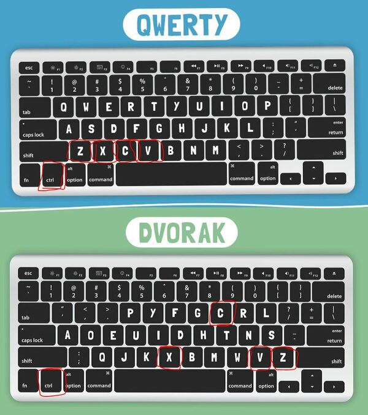

## Dvorak experience

As a QWERTY touch typist, I've always wondered whether I should learn DVORAK keyboard layout. After almost three years of using it, I can highlight essential points for and against it. The short answer - you shouldn't learn it. The long one - you definitely should!

I should also say that I am an extensive VIM user, and I'm currently using Windows OS with a lot of keyboard shortcuts, I am also occasionally gaming. So DVORAK is assessed from these point of views:

* Typing speed
* Typing comfort
* Health
* VIM usage
* Coding
* Windows / software shortcuts
* Gaming

### Learning QWERTY

I started learning touchtyping at the end of 2010 year. It was a QWERTY layout. At first, my speed was slow, but I practiced it a lot throughout a year and was able to do 70-80 WPM towards the end of 2011.

> WPM means Words per Minute. One word is supposed to be exactly 5 characters, including all punctuation or space symbols, which means that the speed of 100 WPM would equal to 100 * 5 = 500 characters per minute.

I continued practicing touchtyping whenever I can and soon I was able to type 80-90 WPM, sometimes 95-98 WPM, while being completely relaxed. My speed averaged at 90 WPM, and I was content with it.

I always wanted to type faster than 100 WPM. It's a beautiful number, and having typing speed over 100 WPM is more impressive than over 90. But I was mostly below 90 WPM. I also noticed one thing: the faster I typed, the more error-prone my typing was. Specifically, I started typing letters in the wrong order. So, instead of `would` I would type `wolud`, because some of my fingers were so eager to take their part in my typing session that they started pressing keys before the other fingers were supposed to press their keys.

My first thought was that my keyboard is to blame. So I acquired myself a mechanical keyboard with tactile switches that gave feedback on whether the key was pressed or not. This helped, but not by much. My speed increased, and sometimes I even managed to type faster than 100 WPM (very rarely), but then I started making the same mistakes again.

My second thought was that I reached some barier that I cannot overcome. I thought my brain was not capable of typing faster. Then I gave up. Until I read about [DVORAK](https://en.wikipedia.org/wiki/Dvorak_keyboard_layout).

### Learning DVORAK

Basically, QWERTY keyboard is a legacy from typewriter machines, where the keys pressed together would jam so specific keyboard layout was developed in order to keep the keys from jamming, meaning that ideally when typing words, keys from different parts of a typewriter machine should be pressed as far from each other as possible. It kept keys from jamming, but it created a whole bunch of other problems:

* overall typing speed was reduced
* you needed to stretch your fingers wide and often, resulting in a lot of addinional strain on wrists

The standard bled into PC industry though, and all our modern keyboards that don't have the jamming issue still have the QWERTY layout.

Then Mr. Dvorak came into play. He suggested another keyboard layout, specifically designed for the comfort and speed. After analyzing a lot of English texts, a layout was created that utilized the home row of the keyboard as much as possible and made it so that you need to move your fingers from the home row as little as possible. So yes, DVORAK was created with an English language in mind. It can still be used with other languages, but it might not be as efficient as for English.

As a result, this layout allowed fingers to practically rest on the home row, strain on the wrists was supposed to be minimized and typing speed increased.

So, after almost nine years of using QWERTY layout, at the end of 2019, I finally decided to try learning DVORAK.

To say that it was painful is to say nothing. I was typing extremely slow, again. After 9 years of happy life, not ever thinking about how to type something or which keys are where. I couldn't continue using QWERTY either: I was determined to switch to DVORAK completely. I was sure my brain would not take it easy using two layouts at the same time.

First couple months were a pain my the arse. I practiced a lot, I learned all the keys, and then slowly, very slowly I started gaining speed. At the end of first months I was confidently typing 30-40 WPM. After that, it was a question of practice.

I signed up with one of the top teams on [Nitrotype](https://www.nitrotype.com) (one of the requirements of top teams is usually typing at least 50-60 races per day, so it was a good incensive for me). And I started typing.

After one month, I was typing 65-70 WPM, after another - 80-85 WPM. After that I fell into stagnation for half a year. I was excruciated. I couldn't even reach the same speed as before (on QWERTY). It looked like I'd plateaued again, only on QWERTY this plateau has been in the range of 95-100 WPM, where on DVORAK it happened at 80 WPM.

However, one thing felt definitely better. My fingers and my wrists. My fingers were much more relaxed now. They almost didn't move from the home row, they didn't stretch, they felt good and not tired at all. And furthermore, my wrists didn't hurt anymore. Previously, while typing on QWERTY, I had a carpal tunnel syndrome in my right wrist and from time to time it hurt. I am happy to say, that after switching to DVORAK this issue has disappeared from my life completely.

> To be fair, I have no idea whether the DVORAK helped with carpal tunnel syndrome or my new keyboard, UHK. I started using UHK because it allows you to place two separate halves of keyboard where it's comfortable for you, and your wrists are much more relaxed and not bent anymore.

> 

So I was determined to continue using DVORAK, even if it meant slower typing speed and less confidence, because my wrists and fingers felt better. Apart from slower speed, I was also struggling for consistency. Because I was relearning from one layout to another, and not learning from scratch - sometimes my brain decided that this key was actually where it would be in QWERTY layout and try to press it there. The situation was aggravated by the fact that some of the keys in QWERTY and DVORAK layouts were at the same place (like `a` and `m`), which didn't help the brain to switch to new layout easily. With time, I got more confident, but I still felt this gnawing sensation that I'm not sure what I'm typing is what I'm typing. In QWERTY, I was comfortably typing and I knew without looking at the screen that I made a mistake when I made one. In DVORAK, when I would make a mistake - I would miss the fact that I made a mistake.

After almost 3 years of using DVORAK, my confidence got up, and with it my speed. Currently (in 2022) I'm able to type 90-95 WPM consistently, which is my previous QWERTY speed, but I'm also able to set over-100 WPM records much more often than on QWERTY. I think I'm finally starting to type faster than I was able to type on QWERTY, while feeling all the comfort DVORAK provides.

I'm still not 100% confident, and this is unpleasant, especially when I'm typing a password and getting it wrong. I was more confident on QWERTY. I'm getting there though. With every passing day I feel that my confidence grows, and I think in a year or two I'll be able to be as precise as on QWERTY. I was using QWERTY for 9 years after all, and DVORAK only for 3. So I decided to stay with DVORAK for now and completely forget about QWERTY.

This isn't all, though. If typing English texts were all we need do with keyboard, I would definitely recommend everyone to make the switch without second thought. Alas we have a lot more concerns.

### Other concerns

#### VIM

If you are a user of VIM text editor, you know that using VIM is almost like to speak a language, or like to touchtype. It's shortcuts create a flow that your body learns and then you're moving chunks of text as if by thought. When I need to delete a word, I just write `daw` (delete a word), and the word on which the cursor currently located is deleted. The truth I learned when learning DVORAK is this: I don't actually think "press d, then press a, then press w", I don't even think "type daw". I just use a vim command by body muscle memory, same as with touchtyping. So naturally, when I switched to DVORAK, I couldn't use VIM at all! I just pressed all the wrong keys all the time. Not only I needed to re-learn the keyboard layout, I also needed to learn VIM from scratch!

So I went through vimtutor, and I started using Vim from scratch. Very slowly and painfully I built the muscle memory back. Even right now (2022), I'm still not using Vim to the whole extend I was using it before.

Also please note that Vim shortcuts were made with QWERTY in mind, so some of the shortcuts might feel weird at first, especially hjkl movement. I got used to it though, so with time it's possible to re-learn Vim in DVORAK, and it's not so bad. It's actually kinda good. For example, `jk` movement is moving cursor up and down, and `hl` movement is moving it left and right. Well, now the `jk` keys are under left hand, and `hl` keys are under right one. It's ever more convenient then having all of them under the right hand, so you can move in both directions at the same time. But it will definitely make your time as painful as it can get, and you will need to learn whole Vim again.

#### Coding

Original DVORAK layout was designed with English language in mind, not computer programs. Which means that very rare symbols like `{}`, `()` and `\=/` are as far from your home row as possible. It's still very uncomfortable for me to press `{` and `}` symbols and I miss half of the time.

There is of course a Programmer's DVORAK layout, designed specifically for programmers, but it's not as universal as the original DVORAK. Original DVORAK is present in almost all operation systems and you can just switch it on, Programmer's DVORAK requires separate installation and might not be present everywhere. So I decided to stick with the widespread DVORAK layout.

But maybe in future I might learn programmer's dvorak and it will enhance my work even more.

#### Shortcuts

Now, shortcuts (both in software and in games) are the real pain. Imagine that you need to cut, copy and paste something, and then undo something using `Ctrl+X`, `Ctrl+C`, `Ctrl+V`, `Ctrl+Z` shortcuts. All the shortcuts were designed with QWERTY keyboard in mind, as you can see. All the keys are aligned perfectly adjacent to each other so you can use `Ctrl+C` and `Ctrl+V` with your left hand, while your right one is using the mouse and placing the cursor where you need.

To do this in DVORAK, you need both hands on the keyboard:

So most of the time when I need to copy something somewhere, I need to place both hands on the keyboard just to perform copy or paste. Also, different software has different shortcuts that are designed for QWERTY layout and might not be as comfortable on DVORAK. However, I learned to live with it. If the software has one or two bad shortcuts, I'll reassign them. So far it was easy to use DVORAK in all the software I use.

Another issue that I came across is with browser tabs (or some other software) where `Ctrl+W` closes the tab. Since `Ctrl+W` is directly adjacent to `Ctrl+V` in Dvorak, it's very easy to press the wrong key and close the tab instead of pasting what you needed to paste. Be careful with it especially if you're filling some form with 100 fields and you've already filled 99 of them and you want to copy the last value and paste it to the page. It's a huge pain to close the page at this stage accidentally (talking from experience). This has trained my precision though, now I know for sure whether I'm pressing `w` or `v`. I'm still occasionally afraid though.

#### Gaming

Finally, couple words about gaming. There are three types of games:

1. Games that work the same, doesn't matter which layout you're on.

For these games, we don't need to do anything. The only thing to remember is that if tutorial tells you to press `i` to open inventory, you should press QWERTY `i`, not the Dvorak `i`. And even if you forget the QWERTY layout, it's not a problem. We tend to press the keys by their position in games, not by their symbol. Nobody presses `wasd` keys to walk forward-backward left-right, everyone just places their arm there and presses the keys as if they were arrow keys. Same principle applies to other keys, with practice.

2. Games that work on qwerty, but have key mapping settings.

For these games, I'm going into settings and remapping all the keys to correspond to my Dvorak layout. It's a bit tedious, but once you do this you can play the game without switching layouts, which is great.

3. Games that work on qwerty and don't allow configuring the keys.

Unfortunately, we cannot do anything for these games apart from switching the keyboard layout to US (QWERTY) layout. For this purpose, I have a separate qwerty layout configured in the system, which I'm using only for this case.

### Conclusion

I can conclude that if you do not have the impulsive need to type as fast as you possibly can, and you don't have any health issues with your fingers or your wrists, you should stay on the QWERTY layout, especially if you are already touchtyping. It is widespread and all software and gaming shortcuts use it.

If you have health issues while touchtyping on QWERTY, or if you are only learning touchtyping, you might consider learning DVORAK.

These are my closing arguments:

* Typing speed - both QWERTY and DVORAK feel the same after a lot of typing, of course initially when re-learning your speed will be much slower
* Typing comfort / Health - DVORAK definitely shines here, if you want to feel like your fingers are at home - learn DVORAK now!
* VIM usage - you will need to re-learn whole VIM, and some shortcuts might be weird on the DVORAK
* Coding - default English DVORAK is ill suited for coding symbols like `{}`, it would be best to learn some alternative like Programmer's DVORAK, but I cannot commend it yet because I haven't tried it myself
* Windows / software shortcuts - shortcuts are a pain in DVORAK, but it is manageable with time & configuration
* Gaming - be prepared to have a separate QWERTY keyboard layout installed in the system just for gaming
