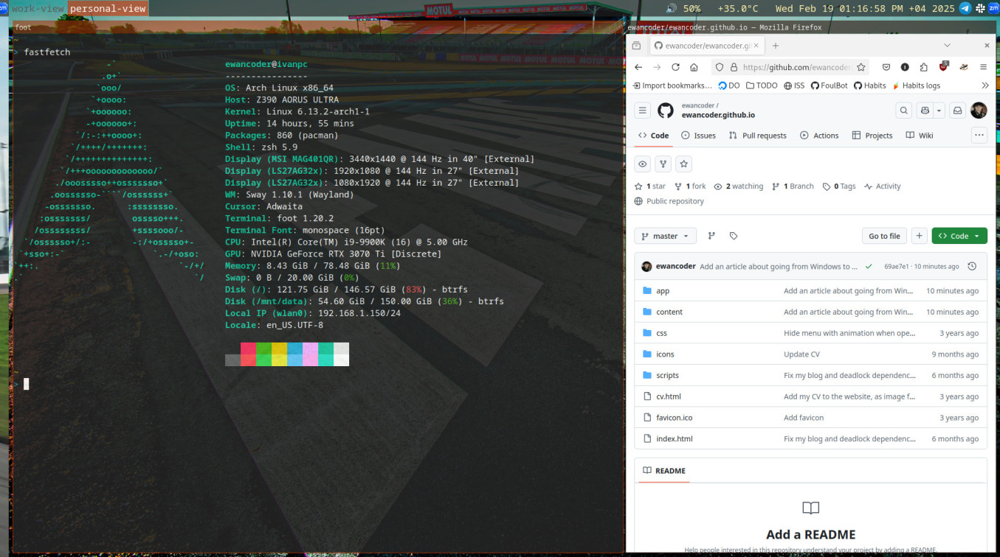

## Moving back to Linux

> 19 February 2025

This is a story of migrating back to Linux after 10 long years of using Windows 10.

[TOC]

Let me start from this: I hate Windows 11. Sure it's probably more secure than Windows 10, it is also supposed to be more performant (albeit it breaks from time to time judging by the news I read). But I still hate it.

For one, it doesn't let me place my taskbar on the top. I am used to having the taskbar on the top of the screen, it is more convenient to me. And it's a major drawback that they stopped giving that customization option to us.

Furthermore, many things became less convenient: to select a WiFi network you need to do two clicks now instead of one, there's no apparent way to make all tray icons show up at all time (at least I didn't find one straight away), a lot of customization options are toned down to what Microsoft thought is the user preference should be.

This all led to me having Windows 10 installed on all my machines still at this time, in 2025. I was even prepared to keep using Windows 10 after the end of it's support due at the end of the year (Microsoft promised 3 years of paid support after that, and beyond that I guess I could've used third party tools for the security patches that I need).

### The push that came to shove

On one fateful, defining evening everything changed. I woke up, joined some work calls from my PC, and opened a laptop. It was then that I became utterly befuddled: Windows 11 desktop was happily greeting me, mocking me, giving me the reason to question my existence. Despite all the measures I put into the place to have it never update from Windows 10 to Windows 11, despite disabling all telemetry with Shutup 10, despite having an offline account - Microsoft decided it's time for an update and, without asking my permission, upgraded my perfectly fine Windows 10 system into an abysmal horrid mess. My taskbar, obviously, had been misplaced and cheerfully greeted me from below.

This is the moment when I told myself: enough.

Here I should digress and let you know: I've been using linux in the past, like 10 years ago, before Windows 10 was a thing. Then, after it came out, I was kinda content with the way it felt so I ditched Linux altogether. And as 10 long years have passed I wasn't already sure I knew linux anymore, but Windows 11 installing on my laptop without my permission was the last straw.

So I told myself: enough. I downloaded a live cd for the Arch distro (the one I was using 10 years ago) and installed it on the laptop on a separate partition, to see how it goes.

To say that it went well is to say nothing. It went amazing! The advancements that were made in the last 10 years were a sight to behold. Namely, I do remember how hard it was to do particular things on Linux:

- setting up your sound system was a horrid experience, there were many different configurations with alsa/pulseaudio/jack subsystems contenting with each other, now we have a unified **pipewire** stuff
- gaming was pretty much nonexistent, now we have **Proton** with **Steam** running pretty much any game with almost native performance
- setting up graphical environment with many monitors was difficult, and you needed many hacks to make it beautiful (unless you used something like KDE or Gnome) - you needed a separate **compositor** type of app that let you draw transparent windows in XServer environment. Now - we have **Wayland**
- and many many more quality of life improvements

As a result, I went head first into the linux ecosystem hoping to maybe set it all up in a week and then tweak it to my liking over the next month, in the meantime solving issues and errors as I go. In reality though - I set it all up in one seating, and it's still working as expected, there weren't any issues to tackle and the system **just works**. It's the same level of quality as Windows offers out of the box: you have a working system, and you just use it.

It's probably laughable to anyone who is a contemporary Linux user to hear this, but to someone who haven't been using it for 10 years straight it's the truth: a simple fact that I can turn on my bluetooth headphones, and they automatically connect to my linux system and output a good quality sound without delays - is a remarkable sight.

In fact, my linux system works so well now that I don't have anything to improve. I love being able to tweak something now and then and improve how my system works overall, but now I just have it working as I want it to work.

So now I have it both on laptop and on PC, and I haven't logged to Windows once in the last 10 days. I simply don't feel the need to.

There are many stories I could tell about this migration: software I installed, problems I tackled (yes there were a few, but they were little). How do I develop .NET code while using Linux (not quite huh). And I will, in other articles. I'm determined to keep my articles short and to the point. And the point of this one - Linux has changed a lot, and into a better side. If you wanted to try it, or if you don't like your current OS - try it, now is the time.
