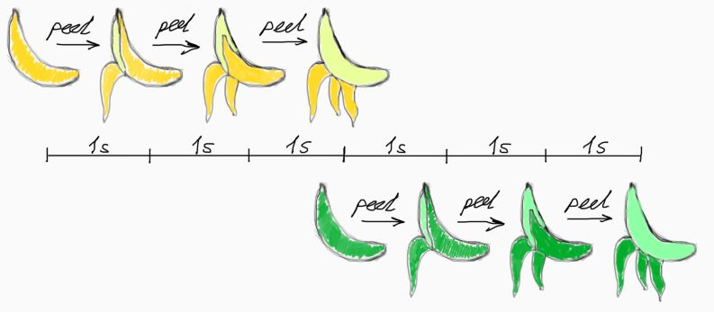

## Introduction to concurrency

This is a short introduction into the world of concurrency: what it is, why we need it, and what programming problems we need to tackle when working with concurrency.

[TOC]

Almost any application requires some kind of ability to run multiple tasks in parallel. When we are fetching data from database, we don't want the UI to freeze, we want the user to be able to click buttons and use our application. This requires two jobs running simultaneously at one time: *fetching the data* and *drawing the UI*.

**Concurrency** is the ability to run multiple processes at the same time, i.e. concurrently.

Concurrency has many aspects and we will discuss them in details, but first let's ask ourselves a question: how does one achieve concurrency?

### Peeling bananas on a single-core CPU

> The following examples are extremely simplified so that fundamental concepts of concurrency can be understood without delving into the depths of real CPU structure and operation.

First let's discuss how single-core CPU performs operations. Simply put, single-core central processor unit (CPU) performs instructions in an orderly fashion, one by one, in a row. It cannot execute two operations simultaneously, it will always execute them one by one.

Imagine that you need to peel a banana. That takes removing three skins from it, so you remove them and the banana is peeled.

Now, imagine that you need to peel two bananas. You first peel the normal one, then the blue one. Both bananas are peeled. But you cannot peel them both at the same time: you only have two hands, and you need to use one hand to hold the banana, and another to peel it. You can only perform one operation at a time (`peel`) on one banana. Also let's imagine that peeling one skin takes 1 second.

That's what single-core processor does: it performs operations one at a time:

- `peel` on normal banana (1s)
- `peel` on normal banana (1s)
- `peel` on normal banana (1s)
- `peel` on blue banana (1s)
- `peel` on blue banana (1s)
- `peel` on blue banana (1s)

So, peeling one banana takes 3 seconds, peeling two bananas takes 6 seconds.

Now, the person who asked us to peel the normal banana is happy. His banana has been peeled very fast, in mere 3 seconds! Now he can eat it. But the person who brought us the blue banana is angry. He was sitting there waiting for his banana to be peeled for 6 whole seconds. And what's worse, his banana hasn't even started to be peeled for 3 whole seconds! So from the point of view of the blue person - his request got frozen for 3 seconds and got picked up only after this time has elapsed.

Can we improve this situation? Yes. We can use **context switching**. This is basically what it says: let's constantly switch between context of peeling the normal banana, and the context of peeling the blue one. Instead of first peeling normal one, and then blue one, let's peel them like this:

- `peel` normal banana (1s)
- `peel` blue banana (1s)
- `peel` normal banana (1s)
- `peel` blue banana (1s)
- `peel` normal banana (1s)
- `peel` blue banana (1s)

Now, peeling both bananas still takes 6 seconds (actually 7, more on that below), but both normal and blue persons can see the progress of their bananas being peeled. Of course we are peeling the normal banana slower now.

While peeling two bananas at the same time, we needed to put the first banana on the table, take the second one, peel it, put it back to the table and take the first one. All this putting and taking also takes time, so in total we spent 7 seconds instead of 6 just because we were constantly switching context. The lesson from this example is - context switching hurts performance.

This is how operating system is working. How are you able to move your mouse cursor on the screen while a number of programs are running in the background at the same time? The answer is - **context switching**. Operating system is constantly switching context, so now it moved the mouse cursor by one pixel, now the first program wrote a piece of data into the memory, now the second program updated a piece of the screen, and now the mouse cursor moved again. Operating system always switches context between thousands of different processes and threads, so that we may enjoy the smooth flow. We don't want to wait for the program to finish so that our mouse cursor may move. We want to see it moving from the start. So operating system does a lot of things in parallel, while using the same single-core CPU that it has.

However, using context switching we were able to do more than one task in parallel. This completely qualifies as **concurrency**. But it is not **parallelism**.

### Peeling bananas on a multi-core CPU

**Parallelism** - ability to execute multiple processes in parallel without context switching, i.e. truly in parallel.

If we want to peel both bananas in parallel, we need a second person who can take the blue banana. We need a second CPU. If we have two persons (two CPUs), each person takes his own share of tasks and we can do them completely in parallel, without context switching.

Now peeling each banana takes 4 seconds, and peeling both bananas also takes 4 seconds! We cut the time by half, and we didn't even need to do any context switching! All we needed is another CPU (Person).

Multi-core CPUs have multiple independent processing units which can do work completely independently from the other cores, behaving like another persons in this example.

This is the main feature of **parallelism**: true parallelism can be achieved only through independent processing units that can do work in parallel, whereas **concurrency** can be achieved whether through true **parallelism** or through **context switching**.

### CPU-bound vs I/O bound

Now what if apart from peeling one banana, we need to also pour a full glass of water, and it takes 3 seconds. We can do it like this:

- peel a banana (1s)
- peel a banana (1s)
- peel a banana (1s)
- place the glass under water (0.001s)
- wait until the glass full (3s)
- take the glass (0.001s)

Do you see a problem here? We are waiting for the whole 3 seconds just in vain. We took 6.002 seconds to peel a banana and fill a glass with water, when we could've peeled the banana **while** the water was pouring into the glass. Let's improve this using **context switching**:

- place the glass under water (0.001s)
- peel a banana (1s)
- peel a banana (1s)
- peel a banana (1s)
- wait until the glass is full (already full, 0s)
- take the glass (0.001s)

Now we spent only 3.002 seconds, saving whole 3 seconds, using a single-core CPU (single Person).

This is a very important distinction:

Peeling a banana is CPU-intensive work, it requires CPU (Person) to actively do stuff, the banana won't peel itself, the CPU (Person) should apply some effort to peel the banana. After peeling bananas for hours, Person (CPU) would be tired (overheated). It will use Person capacity to 100% (100% utilization of CPU). Person cannot do anything else while peeling the banana (CPU cannot do anything else while performing a CPU-intensive task). This is called **CPU-Bound work**, because we need the CPU to do it, and CPU is completely utilized to 100% while doing it.

We don't need the CPU (Person) to pour the water into the glass, the water is being poured by the tap in the sink. It pours into the glass by itself, Person (CPU) doesn't do anything. Person (CPU) can either wait for the result (while not doing anything, and thus wasting it's time for nothing), or it can do important work in the meantime (peeling other bananas, CPU-bound work) while waiting for the glass to be filled. This is called **I/O Bound work**, because we do **NOT** need the CPU to do this work. This work is being done by **I/O (input/output)** devices, some other systems (like the tap in the sink in our example), and CPU just needs to check from time to time whether this other I/O device has finished its work or no. Actually, CPU is usually notified about the result of the I/O device, so that it can continue with processing the results of this work.

Good real-world example of **CPU-bound** work would be:

- Math (calculating numbers, CPU is definitely needed here)
- Iterating and processing data (while iterating, CPU is reading memory and going in loops, so we definitely need CPU here)

Good real-world example of **I/O-bound** work would be:

- Reading the data from the database on another machine. CPU sends a command over the network, and then the other PC does all work and sends the data to this PC, and our CPU just waits for all the data to arrive through the network.

#### CPU-bound work

Let's look closer at CPU-bound work, specifically it's limiting factor. We cannot make it faster by using context switching.

If we have one Person, and we ask him to peel multiple bananas at the same time, he will actually do it slower than one by one, because he will constantly need to switch the context. The only way to make it faster - is to invite another Person to join the fun.

The same with CPUs. If you want some math problem to calculate faster, or if you want your data to be processed faster - you cannot parallelize it in 10 threads if you just have one CPU core. You can only have one thread, or it will actually go slower. If you have 8-core CPU, it's like you have 8 People who can peel bananas. You can create 8 threads and parallelize your CPU-bound work, so that your data processing or math calculations are happening in 8 parallel chunks. All the 8 cores will use up their 100% capacity and will work to the best of their abilities. But if you ask them to peel 12 bananas, they will struggle. Some of them will use context switching to switch between bananas and it will slow the system down.

Hence, here's an important conclusion: whenever you have CPU-bound work, you should only use the same amount of threads or even less than the amount of physical CPU cores you have available. Using more will not profit you, and might actually make things slow down.

#### I/O-bound work

Now let's look at I/O bound work. We can make it faster by using context switching, because this work does not require CPU resources. Actually, even if we have 100 cores in our CPU, we can use just one with context switching, and it should be enough.

Imagine we need to fill 10 glasses of water, and we have just one Person. The person would place all 10 glasses in the sink and let the water fill them, and while they're filling he'll even be able to rest or to do some other important work. We don't need the Person (CPU) to watch and wait while the glasses are filling.

However, the main question here is: how many glasses can our sink fill at the same time. What if we only have a very slow-running water streak coming from the tap? Then while one glass will be filled in 4 seconds, two glasses will be filled in 8 seconds, and three glasses will be filled in 12 seconds. In this situation, it may be preferable to fill the first glass first, and only then proceed with other ones.

The real-world example of I/O-bound work is getting data from the database over the network. Let's imagine our network allows us to download data with the speed of 100 Mb/s. But the database can only give us data with the speed of 10 Mb/s. This means we can ask for as much as 10 parallel retrievals of data, but not more. If we ask for 20 retrievals of data, the database will give us 20 * 10 = 200 Mb/s of data, but we are able to download with the speed of only 100 Mb/s. We are going to be limited by our I/O channel (network in this example). We could have received the first 10 retrievals faster than we would if we request all 20 of them at the same time.

Hence, here's another important conclusion: whenever you have I/O-bound work, you need to consider your I/O channel limitations and plan accordigly. You can make 1000 parallel requests to the database and it won't hinder your CPU a bit, but you'll get your data much later than you would've gotten those first 10 requests had you requested just them. So think whether you need all the data at once, or you can request the data bit by bit utilizing your I/O speed to the maximum, and already use the first half of retrieved data while the second half is still loading.

### WIP.
