## Introduction to concurrency

This is a short introduction to the world of concurrency: what it is, why we need it, and how we can use it.

[TOC]

Almost any application requires some kind of ability to run multiple tasks in parallel. When we are fetching data from database, we don't want the UI to freeze, we want the user to be able to click buttons and use our application. This requires two jobs running at the same time: *fetching the data* and *drawing the UI*.

**Concurrency** is the ability to run multiple processes at the same time, i.e. concurrently.

Concurrency has many aspects and we will discuss them in details, but first let's ask ourselves a question: how does one achieve concurrency?

### Peeling bananas on a single-core CPU

> The following examples are extremely simplified so that fundamental concepts of concurrency can be understood without delving into the depths of real CPU structure and operation.

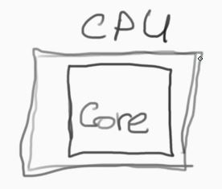

First let's discuss how single-core CPU performs operations. Simply put, single-core central processor unit (CPU) performs instructions in an orderly fashion, one by one, in a row. It cannot execute two operations simultaneously, it will always execute them one by one.

Imagine that you need to peel a banana. This entails the following:

- One banana has 3 skins on it
- Peeling one skin takes 1 second
- While peeling a banana, you cannot do anything else. You are using all your resources (two hands) to 100%

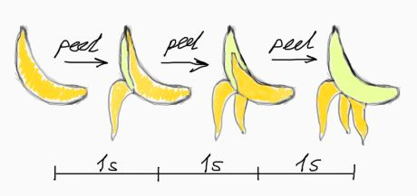

Now, imagine that you need to peel two bananas. First you peel the normal one, then the green one. Both bananas are peeled. But you cannot peel them both at the same time: you only have two hands, and you are using them to 100% while peeling a banana (you need to use one hand to hold the banana, and another to peel it). You can only perform one operation at a time (`peel`) on one banana.

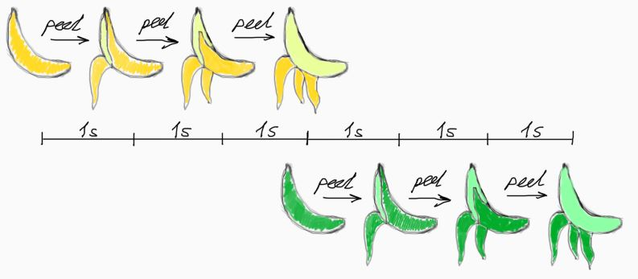

That's what single-core processor does: it performs operations one at a time:

- `peel` on normal banana (1s)
- `peel` on normal banana (1s)
- `peel` on normal banana (1s)
- `peel` on green banana (1s)
- `peel` on green banana (1s)
- `peel` on green banana (1s)

And while doing this, the CPU is completely occupied. It uses 100% of it's own resources to peel bananas as fast as possible, and while it's peeling a banana - it's unable to do anything else. In fact, after peeling lots of bananas, the CPU becomes tired (hot) because it was working at 100% capacity for quite a bit of time, peeling banana after banana.

So, peeling one banana takes 3 seconds, peeling second banana takes another 3 seconds, totalling in 6 seconds.

Now, the person who asked us to peel the normal banana is happy. His banana has been peeled very fast, in mere 3 seconds! Now he can eat it. But the person who brought us the green banana is angry. He was sitting there waiting for his banana to be peeled for 6 whole seconds. And what's worse, his banana hasn't even started to be peeled for 3 whole seconds! So from the point of view of the green person - his request got frozen for 3 seconds and got picked up only after this time has elapsed.

Can we improve this situation? Yes. We can use **context switching**. This is basically what it says: let's constantly switch between context of peeling the normal banana, and the context of peeling the green one. Instead of first peeling normal one, and then green one, let's peel them like this:

- take normal banana
- `peel` normal banana (1s)
- put down the normal banana
- take green banana
- `peel` green banana (1s)
- put down the green banana
- take normal banana
- `peel` normal banana (1s)
- put down the normal banana
- take green banana
- `peel` green banana (1s)
- put down the green banana
- take normal banana
- `peel` normal banana (1s)
- give peeled normal banana to the end user
- take the green banana
- `peel` green banana (1s)
- give peeled green banana to the end user

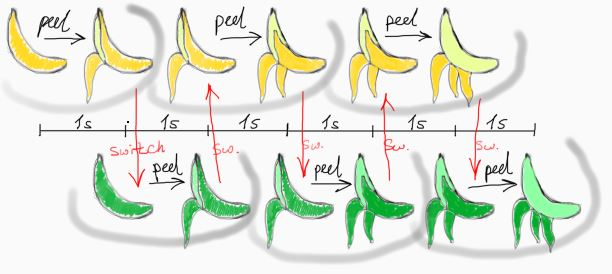

Now, peeling both bananas still takes 6 seconds, but both normal and green persons can see the progress of their bananas being peeled. Of course we are peeling the normal banana slower now.

While peeling two bananas at the same time, we needed to put the first banana on the table, take the second one, peel it, put it back to the table and take the first one. All this putting and taking also takes time (shown by red arrows), so in total we spent 7 seconds instead of 6 just because we were constantly switching context. The lesson from this example is - context switching hurts performance.

This is how operating system is working. How are you able to move your mouse cursor on the screen while a number of programs are running in the background at the same time? The answer is - **context switching**. Operating system is constantly switching context: now it moved the mouse cursor by one pixel, now the first program wrote a piece of data into the memory, now the second program updated a piece of the screen, and now the mouse cursor moved again. Operating system always switches context between thousands of different processes and threads, so that we may enjoy the smooth flow and every program can run in parallel with all others. We don't want to wait for the program to finish so that our mouse cursor may move. We want to see it moving from the start. So operating system does a lot of things in parallel, while using the same single-core CPU that it has.

### Threads

But how does the first person know that we finished peeling his banana? Every program needs to track its own execution. How can we do this, if CPU constantly switches between different processes? When OS schedules some job to the CPU (like peeling a green banana), it does so using an abstraction called **Thread**. Here we finally came to some important terminology: **Thread** (or OS Thread) is a logical unit of work that needs to be completed as a set of consecutive instructions on a CPU. OS provides and manages this abstraction for us, so we can schedule work on different threads and wait for them to finish. If we take the example above, we can say that:

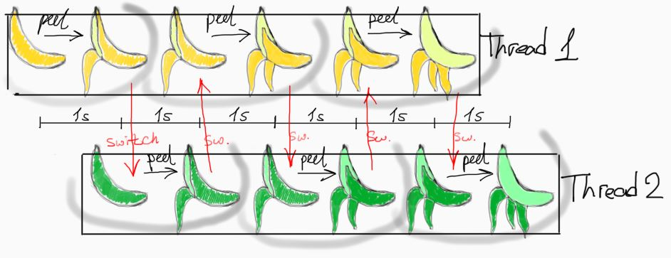

- Peeling a yellow banana is happening on Thread 1
- Peeling a green banana is happening on Thread 2
- CPU is constantly switching between threads 1 and 2 to make it seem as if both threads were running in parallel with each other (peeling both bananas at the same time)

> Actually, it's the OS that schedules instructions in such a way so different threads are running at the same time. CPU itself is only executing what was asked of it. So, OS asks CPU to peel a piece of yellow banana, then it asks CPU to put it down and to take a green one, and then it asks CPU to peel a piece of green one now.

Using context switching we were able to do more than one task in parallel on a single-core CPU. This completely qualifies as **concurrency**. But it is not true **parallelism**.

### Peeling bananas on a multi-core CPU

**Parallelism** - ability to execute multiple processes in parallel without context switching, i.e. truly in parallel.

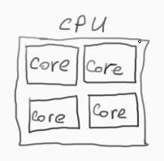

If we want to peel both bananas in parallel, we need a second person who can take the green banana. We need a second CPU. If we have two persons (two CPUs), each person takes his own share of tasks and we can do them completely in parallel, without context switching.

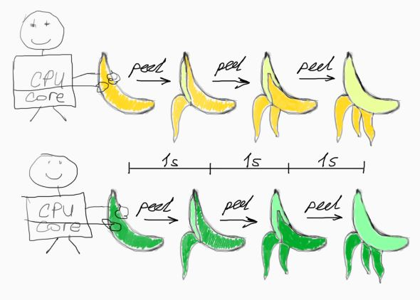

Now peeling each banana takes 3 seconds, and peeling both bananas also takes 3 seconds! We cut the time by half, and we didn't even need to do any context switching! All we needed is another CPU (Person).

Multi-core CPUs have multiple independent processing units which can do work completely independently from the other cores, behaving like another persons in this example.

This is the main feature of **parallelism**: true parallelism can be achieved only through independent processing units that can do work in parallel, whereas **concurrency** can be achieved whether through true **parallelism** or through **context switching**.

### CPU-bound vs I/O bound

The work we saw previously was called **CPU-Bound**, because we needed the CPU in order for it to be executed. Peeling bananas is hard work. CPU should be working 100% on it and it cannot do anything else while it's peeling bananas, so we are using all CPU resources that we have, straining them to peel bananas for us as fast as possible.

Now what if apart from peeling one banana, we also need to fill a bottle of water from a nearby sink, and it takes 3 seconds to do this. We can do it like this:

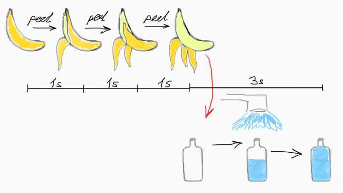

- peel a banana (1s)
- peel a banana (1s)
- peel a banana (1s)
- place the bottle under water (0.001s)
- wait until the bottle full (3s)
- take the bottle (0.001s)

Do you see a problem here? We are waiting for the whole 3 seconds just in vain. We took 6.002 seconds to peel the banana and fill the bottle with water, when we could've peeled the banana **while** the water was pouring into the bottle. We only need the CPU to put the bottle of water under the sink tap, and then to take it after it has filled. CPU itself is not pouring the water from the sink tap, it's the sink's tap job. Let's improve this using **context switching**:

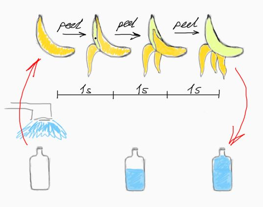

- place the bottle under water (0.001s)
- peel a banana (1s)
- peel a banana (1s)
- peel a banana (1s)
- wait until the bottle is full (already full, 0s)
- take the bottle (0.001s)

Now we spent only 3.002 seconds, saving whole 3 seconds, using a single-core CPU (single Person).

This is a very important distinction:

Peeling a banana is CPU-intensive work, it requires CPU (Person) to actively do stuff, the banana won't peel itself, the CPU (Person) should apply some effort to peel the banana. After peeling bananas for hours, Person (CPU) would be tired (overheated). It will use Person capacity to 100% (100% utilization of CPU). Person cannot do anything else while peeling the banana (CPU cannot do anything else while performing a CPU-intensive task). This is called **CPU-Bound work**, because we need the CPU to do it, and CPU is completely utilized to 100% while doing it.

We don't need the CPU (Person) to pour the water into the bottle, the water is being poured by the tap in the sink. It pours into the bottle **by itself**, Person (CPU) doesn't do anything. Person (CPU) can either wait for the result (while not doing anything, and thus wasting it's time for nothing), or it can do important work in the meantime (peeling other bananas, CPU-bound work) while waiting for the bottle to be filled. This is called **I/O Bound work**, because we do **NOT** need the CPU to do this work. This work is being done by **I/O (input/output)** devices, some other systems (like the tap in the sink in our example), and CPU just needs to check from time to time whether this other I/O device has finished its work or no. Actually, CPU is usually notified about the result of the I/O device, so that it can continue with processing the results of this work.

So, in our example, the sink is the **I/O** device and CPU is not filling the water into the bottle, that device does all work.

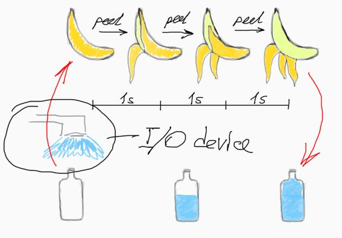

Good real-world example of **CPU-bound** work would be:

- Math (calculating numbers, CPU is definitely needed here)
- Iterating and processing data (while iterating, CPU is reading memory and going in loops, so we definitely need CPU here)

Good real-world example of **I/O-bound** work would be:

- Reading the data from the database on another machine. CPU sends a command over the network, and then the other PC does all work and sends the data to our PC, and our CPU just waits for all the data to arrive through the network.

#### CPU-bound work

Let's look closer at CPU-bound work, specifically it's limiting factor. We cannot make it faster by using context switching.

If we have one Person, and we ask him to peel multiple bananas at the same time, he will actually do it slower than one by one, because he will constantly need to switch the context. The only way to make it faster - is to invite another Person to join the fun.

The same with CPUs. If you want some math problem to calculate faster, or if you want your data to be processed faster - you cannot parallelize it in 10 threads if you just have one CPU core. You can only have one thread, or it will actually go slower. If you have 8-core CPU, it's like you have 8 People who can peel bananas. You can create 8 threads and parallelize your CPU-bound work, so that your data processing or math calculations are happening in 8 parallel chunks. All the 8 cores will use up their 100% capacity and will work to the best of their abilities. But if you ask them to peel 12 bananas, they will struggle. Some of them will use context switching to switch between bananas and it will slow the system down.

Hence, here's an important conclusion: whenever you have CPU-bound work, you should only use the same amount of threads or even less than the amount of physical CPU cores you have available. Using more will not profit you, and might actually make things slow down.

#### I/O-bound work

Now let's look at I/O bound work. We can make it faster by using context switching, because this work does not require CPU resources. Actually, even if we have 100 cores in our CPU, we can use just one with context switching, and it should be enough.

Imagine we need to fill 3 bottles of water, and we have just one Person. The person would place all 3 bottles in the sink and let the water fill them, and while they're filling he'll even be able to rest or to do some other important work. We don't need the Person (CPU) to watch and wait while the bottles are filling.

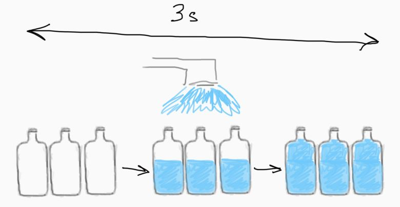

However, the main question here is: how many bottles can our sink fill at the same time. What if we only have a very slow-running water streak coming from the tap? Then while one bottle will be filled in 4 seconds, two bottles will be filled in 8 seconds, and three bottles will be filled in 12 seconds. In this situation, it may be preferable to fill the first bottle first, and only then proceed with other ones.

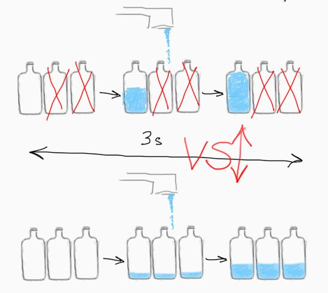

The real-world example of I/O-bound work is getting data from the database over the network. Let's imagine our network allows us to download data with the speed of 100 Mb/s (the output of the sink tap). But one request to the database only works at the speed of 10 Mb/s (the neck of each bottle). This means we can ask for as much as 10 parallel retrievals of data (to fill 10 bottles at the same time), but not more. If we ask for 20 retrievals of data, the database will give us 20 * 10 = 200 Mb/s of data, but we are able to download with the speed of only 100 Mb/s (not enough water from the sink tap). We are going to be limited by our I/O channel (network in this example). We could have received the first 10 retrievals twice faster than we would if we request all 20 of them at the same time and wait for all of them to complete.

Hence, here's another important conclusion: whenever you have I/O-bound work, you need to carefully consider your I/O channel limitations and plan accordingly. You can make 1000 parallel requests to the database and it won't hinder your CPU a bit, it can even peel some bananas in the meantime, but you'll get your data much later than you would've gotten those first 10 requests had you requested just them. So think whether you need all the data at once, or you can request the data bit by bit utilizing your I/O speed to the maximum, and already use the first half of retrieved data while the second half is still loading.

### Hyperthreading

There are CPUs that are hyperthreaded: they have two logical cores per one physical core. For example, hyper-threaded 8-core CPU would have 16 logical cores, 2 for every physical core. How does it work? Does it mean that now we suddenly have 16 **parallel** cores that can do **parallel** operations? Can we peel 16 bananas at the same time using these 16 logical cores?

Well, yes and no. Hyperthreading works in much the same way as context-switching, just on the level below, inside the CPU itself. So the CPU provides OS with information about its cores, and when a regular CPU would report that it has 8 cores, the hyperthreaded CPU reports that it has 16 cores. The OS then schedules work accordingly, and the OS doesn't care that these cores are hyperthreaded - it sends the work to these 16 cores as if they would've been physical ones. So OS thinks that it can send more work to be run in parallel. We are asking our hyper-threaded CPU to peel 16 bananas at the same time.

The CPU accepts this request, but under the hood it uses some kind of **context-switching** mechanism to delegate the work to the underlying 8 physical cores. The CPU doesn't have 16 cores, it can only do 8 parallel jobs at the same time. So in order to do 16 jobs, it delegates a pair of bananas to every physical core, but for every core it switches the context between the two bananas so they can be peeled at the same rate.

Why is this better than context-switching that OS does?

In order for OS to switch context between Banana 1 and Banana 2, OS needs to:

- Save current status of peeling Banana 1 from the status storage
- Erase current status storage
- Write current status of peeling Banana 2 to the status storage
- Do a piece of work for peeling Banana 2 (this is the only step that we saw on the images above)
- Save current status of peeling Banana 2 from the status storage
- Erase current status storage
- Write current status of peeling Banana 1 to the status storage

So, every time we switch between contexts, we need to save all the current ambient information about Thread 1, and insert into the storage the ambient information about Thread 2. Because we only have one storage for storing thread-ambient information. This takes quite a lot of time.

Well, hyperthreading is supported by an actual piece in the hardware - in the CPU itself. In every physical CPU core there are two storages for the current ambient context of the thread, so there's no need to erase and write another thread's context when switching to it. The information about both threads is already being stored in different context storages, which makes the process of switching between threads much faster.

But nonetheless, the physical CPU core is still single one, so there's no more processing power available to you than in non-hyperthreaded CPU. So you should not schedule more highly CPU-consuming work that you have physical processes.